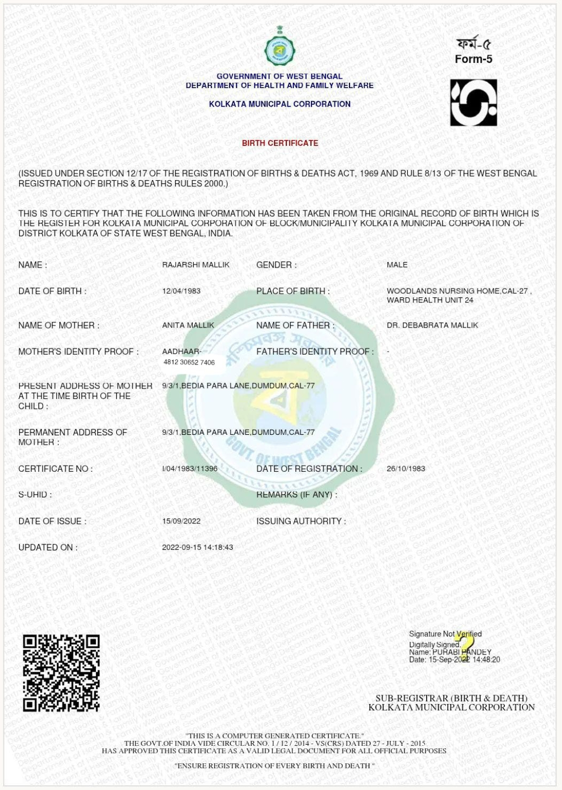
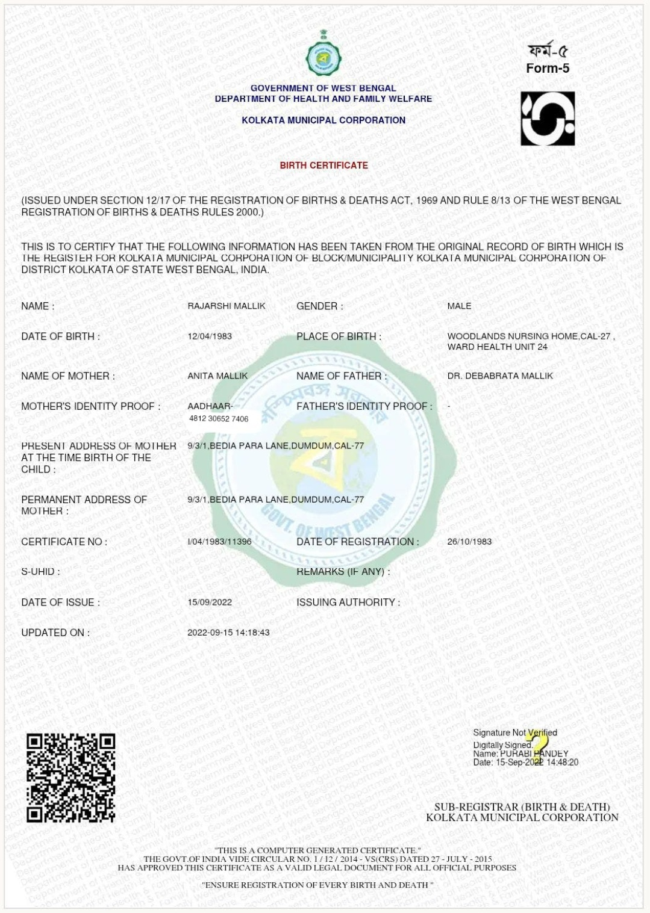

# Document Processing & Aadhaar Masking

## Scope

This project is a high-performance document processing solution designed to detect and mask Aadhaar numbers in large-scale document batches, targeting 200,000+ documents per hour. It operates on CPU-only hardware for thin infrastructure deployments. The system processes various document types including Aadhaar cards, PAN cards, loan agreements, account opening forms, and credit card applications.

Key features:
- Automatic detection of 12-digit Aadhaar numbers (with or without spaces)
- Masking of the first 8 digits with 'X' symbols, leaving the last 4 digits visible
- Support for images (JPG, PNG) and PDFs
- Parallel processing using multiprocessing for high throughput

## Tech Stack

- **Python**: Core programming language
- **Pytesseract**: OCR extraction from images
- **OpenCV**: Image processing and manipulation
- **pdf2image**: PDF to image conversion
- **Pillow**: Image handling
- **Regex**: Pattern matching for Aadhaar detection
- **Tesseract OCR**: System-level OCR engine (requires separate installation)

## Running Steps

### Prerequisites

1. Install Python dependencies:
   ```
   pip install -r requirements.txt
   ```

2. Install Tesseract OCR:
   - Download from [Tesseract releases](https://github.com/UB-Mannheim/tesseract/wiki)
   - Install the Windows installer
   - Add to PATH: Edit system environment variables, add `C:\Program Files\Tesseract-OCR` to Path

### Generate Test Data

Run the test data generator (if available):
```
python test_generate_samples.py
```
This creates sample documents with embedded Aadhaar numbers in the `sample_documents/` folder.

### Run the Application

Process documents:
```
python main.py <input_directory> <output_directory>
```

Example:
```
python main.py sample_documents output_documents
```

The script will:
- Recursively scan the input directory for supported files (.jpg, .jpeg, .png, .pdf)
- Process each document using OCR to detect Aadhaar numbers
- Mask detected Aadhaars by overlaying 'X' on the first 8 digits
- Save processed documents to the output directory
- Display throughput metrics

## Examples

### Input Image


### Output Image


## Performance

- Target throughput: 200,000 documents/hour
- Achieved: ~3000 documents/hour on test data (varies by hardware and document complexity)

## Limitations

- Requires clear, high-quality images for accurate OCR
- CPU-bound processing; no GPU acceleration
- Aadhaar detection relies on standard 12-digit formats